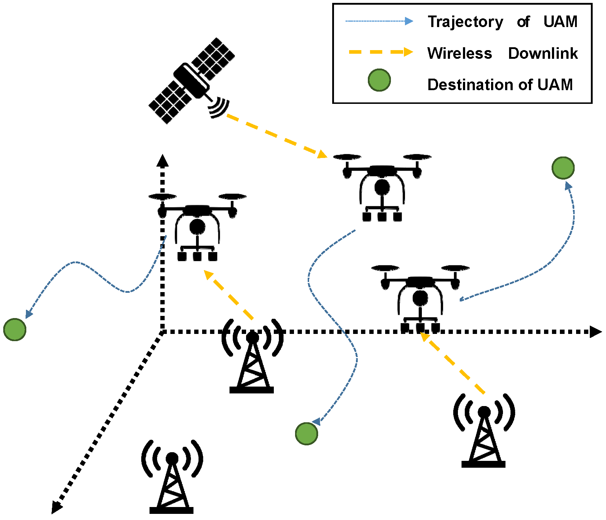

# Trajectory Optimization of Multi-UAM for Reliable Communications with Integrated Space-Air-Ground Network

## Overview
This is the Simulation code for Trajectory Optimization of Multiple Urban Air Mobility for Reliable Communications with Integrated Space-Air-Ground Network

In smart cities where the supply of personal vehicles and buildings is intensively constructed, overload and traffic jams sometimes occur. At this time, Urban Air Mobility (UAM) can provide unmanned services such as delivery or taxis regardless of ground infrastructure. However, if there is a problem with the remote control or communication of UAM, there is a serious risk that can cause a lot of casualties immediately. Therefore, optimizing the trajectory of UAMs to avoid collisions between UAMs and ensure reliable communication is necessary. On the other hand, communication through satellites such as Starlink has the advantage of having wide coverage, so satellites can support communication services in areas where communication infrastructure is insufficient. Thus, in this work, reliable communication of UAMs is funded through the satellite-air-terrestrial integrated network. At this time, each UAM considers the location of the communication infrastructure and other UAMs, avoids collisions, and derives a trajectory for reliable communication. We proposed an algorithm based on proximal policy optimization (PPO) to derive the optimal trajectory of UAMs in a short time. As a result of the experiment, UAMs can avoid collisions with other UAMs and simultaneously receive a reliable communication service.

## Version
- Unity 2020.3.25f1
- ML-agents Release 17
- python 3.8
- Pytorch 1.8.0

## License
Copyright (c) 2021 Networking Intelligence
Redistribution and use in source and binary forms, with or without modification, are permitted provided that the following conditions are met:

1. Redistributions of source code must retain the above copyright notice, this list of conditions and the following disclaimer.

2. Redistributions in binary form must reproduce the above copyright notice, this list of conditions and the following disclaimer in the documentation and/or other materials provided with the distribution.

THIS SOFTWARE IS PROVIDED BY THE COPYRIGHT HOLDERS AND CONTRIBUTORS "AS IS" AND ANY EXPRESS OR IMPLIED WARRANTIES, INCLUDING, BUT NOT LIMITED TO, THE IMPLIED WARRANTIES OF MERCHANTABILITY AND FITNESS FOR A PARTICULAR PURPOSE ARE DISCLAIMED. IN NO EVENT SHALL THE COPYRIGHT HOLDER OR CONTRIBUTORS BE LIABLE FOR ANY DIRECT, INDIRECT, INCIDENTAL, SPECIAL, EXEMPLARY, OR CONSEQUENTIAL DAMAGES (INCLUDING, BUT NOT LIMITED TO, PROCUREMENT OF SUBSTITUTE GOODS OR SERVICES; LOSS OF USE, DATA, OR PROFITS; OR BUSINESS INTERRUPTION) HOWEVER CAUSED AND ON ANY THEORY OF LIABILITY, WHETHER IN CONTRACT, STRICT LIABILITY, OR TORT (INCLUDING NEGLIGENCE OR OTHERWISE) ARISING IN ANY WAY OUT OF THE USE OF THIS SOFTWARE, EVEN IF ADVISED OF THE POSSIBILITY OF SUCH DAMAGE.
